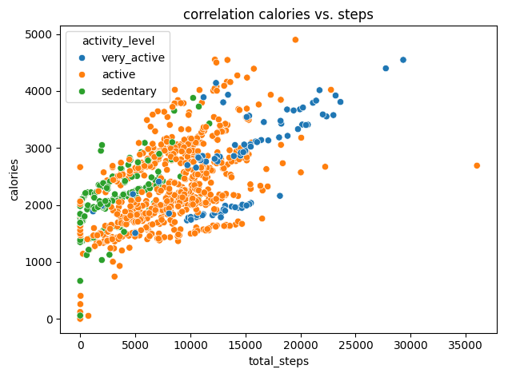

# bellabeat_fitbit_data_nalysis
Proyecto de análisis de datos enfocado en identificar patrones de actividad física mediante datos recopilados por dispositivos Fitbit para generar recomendaciones de negocio para Bellabeat.

## Descripción del proyecto

Este proyecto analiza los datos recopilados por dispositivos Fitbit con el objetivo de identificar patrones en la actividad física y los hábitos de los usuarios. Mediante técnicas de análisis exploratorio de datos (EDA), se estudian indicadores relacionados con la actividad diaria, el sueño y el gasto calórico para obtener información útil que apoye la estrategia de marketing de Bellabeat y el desarrollo de productos enfocados en el bienestar.

## Problema de negocio

Bellabeat busca comprender cómo las personas utilizan los dispositivos inteligentes para identificar oportunidades que permitan fortalecer su estrategia de marketing y promover un uso más constante de sus productos.

## Objetivos

Objetivo general: Analizar los hábitos de actividad física de los usuarios de Fitbit para generar recomendaciones estratégicas que apoyen la toma de decisiones de Bellabeat.

Objetivos especificos:

- Analizar la actividad física diaria de los usuarios.
- Identificar patrones de actividad a lo largo de la semana.
- Examinar la relación entre el número de pasos diarios y las calorías quemadas.
- Clasificar a los usuarios según sus niveles de actividad física.
- Desarrollar recomendaciones de negocio basadas en los resultados obtenidos.

## Preguntas de negocio

- ¿Cuáles son las tendencias actuales en el uso de dispositivos inteligentes para el seguimiento de la actividad física?
- ¿Cómo pueden aplicarse estas tendencias a los productos y servicios de Bellabeat?
- ¿Cómo pueden estos hallazgos fortalecer la estrategia de marketing de Bellabeat?

## Conjunto de datos

- Fuente: Fitbit Fitness Tracker Data (Kaggle).
- Compartido por: Mobius.
- Periodo de recolección: 12 de marzo al 12 de mayo de 2016.
- Formato: 18 archivos CSV.
- Licencia: CC0 (Dominio Público).
  
## Herramientas utilizadas

- Python
- Pandas
- NumPy
- Matplotlib
- Seaborn
- Jupyter Notebook / Kaggle

## Enlace al conjunto de datos

https://www.kaggle.com/code/kevinsotelog/bellabeat-data-analysis

## Principales hallazgos

- Los usuarios presentan niveles de actividad física diferentes según el día de la semana.
- La mayor parte del tiempo registrado corresponde a actividades sedentarias.
- Existe una correlación positiva entre el número de pasos y las calorías quemadas.
- Los minutos de actividad moderada e intensa también muestran una relación positiva con el gasto calórico.
- Los resultados permiten comprender mejor los hábitos de actividad física de los usuarios y detectar oportunidades para incrementar el uso de dispositivos orientados al bienestar.

## Recomendaciones de negocio

- Promover el uso de los dispositivos Bellabeat como una herramienta para el bienestar diario y no únicamente para realizar ejercicio.
- Implementar incentivos y recordatorios personalizados que motiven a las usuarias a mantenerse activas.
- Desarrollar campañas dirigidas a personas con estilos de vida sedentarios para fomentar hábitos saludables.
- Aprovechar la información generada por los dispositivos para ofrecer recomendaciones personalizadas que incrementen el compromiso de las usuarias.

## Vista previa del proyecto

Correlation Between Steps and Calories

In the scatter plot below, we can observe a moderately positive correlation: the greater the number of steps taken, the higher the number of calories burned. 

Average daily steps

The results indicate that Tuesday, Wednesday, and Saturday are the days on which users record the highest levels of physical activity, as the average number of steps on these days exceeds the overall mean. 

