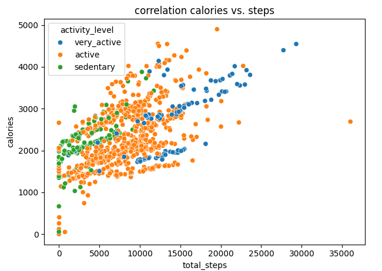
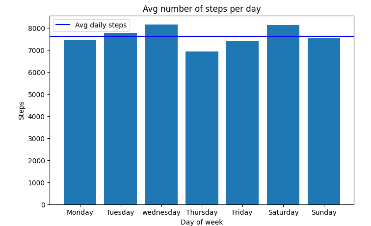
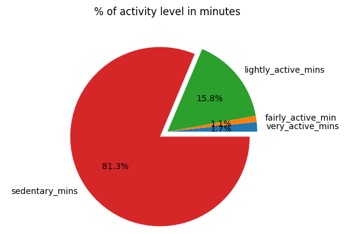
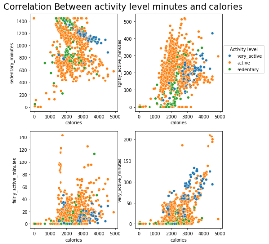

# bellabeat_fitbit_data_analysis
Data analysis project focused on identifying physical activity patterns using data collected from Fitbit devices to generate business recommendations for Bellabeat.

## Project Description

This project analyzes data collected from Fitbit devices to identify patterns in users physical activity and habits. Through Exploratory Data Analysis (EDA) techniques, key indicators related to daily activity, sleep, and calorie expenditure are examined to generate valuable insights that can support Bellabeat’s marketing strategy and the development of wellness-focused products.

## Business Problem

Bellabeat aims to understand how people use smart devices in order to identify opportunities to strengthen its marketing strategy and encourage more consistent use of its products.

## Objectives

General Objective: 
Analyze Fitbit users’ physical activity habits to generate strategic recommendations that support Bellabeat’s decision-making.

Specific Objectives:

- Analyze users’ daily physical activity.
- Identify activity patterns throughout the week.
- Examine the relationship between daily steps and calories burned.
- Classify users based on their physical activity levels.
- Develop business recommendations based on the findings.

## Business Questions

- What are the current trends in the use of smart devices for tracking physical activity?
- How can these trends be applied to Bellabeat’s products and services?
- How can these findings strengthen Bellabeat’s marketing strategy?

## Dataset

- Source: Fitbit Fitness Tracker Data (Kaggle).
- Shared by: Mobius.
- Data collection period: March 12 to May 12, 2016.
- Format: 18 CSV files.
- License: CC0 (Public Domain).

## Tools Used

- Python
- Pandas
- NumPy
- Matplotlib
- Seaborn
- Jupyter Notebook / Kaggle

## Dataset link

https://www.kaggle.com/code/kevinsotelog/bellabeat-data-analysis

## Key Findings

- Users show different levels of physical activity depending on the day of the week.
- Most of the recorded time corresponds to sedentary activities.
- There is a positive correlation between the number of daily steps and calories burned.
- Moderate and vigorous activity minutes also show a positive relationship with calorie expenditure.
- The findings provide a better understanding of users' physical activity habits and help identify opportunities to increase the use of wellness-focused devices.

## Business Recommendations

- Promote Bellabeat devices as tools for daily wellness, not just for exercise.
- Implement personalized incentives and reminders to encourage users to stay active.
- Develop campaigns targeting people with sedentary lifestyles to promote healthier habits.
- Leverage data generated by the devices to provide personalized recommendations that increase user engagement.
- 
## Project Preview

Correlation Between Steps and Calories

The following scatter plot shows a moderate positive correlation: as the number of steps increases, the number of calories burned also increases.

Average Daily Steps

The results indicate that Tuesday, Wednesday, and Saturday are the days when users record the highest levels of physical activity, as the average number of steps on these days exceeds the overall average.

Percentage of Activity Time

The pie chart indicates that users spend most of their time in a sedentary state.

Correlation Between Activity Minutes by Intensity Level and Calories Burned

The chart shows a positive relationship between physical activity and calories burned.

## Skills Demonstrated

- Data cleaning and transformation using Python.
- Exploratory Data Analysis (EDA).
- Data visualization.
- Interpretation of patterns and trends.
- Development of business recommendations.

## How to Run the Project

1. Download the notebook from this repository.
2. Download the dataset from Kaggle.
3. Upload both files to a new Kaggle Notebook or run them in Jupyter Notebook.

